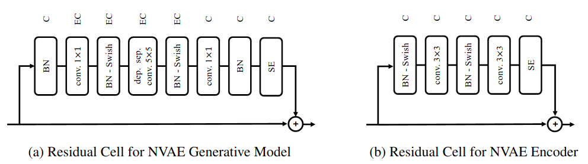
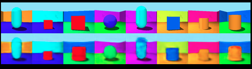

# Latent Geometery
Use a product space constructed from simple 1D structure to do disentanglement learning

## Model
Using a more sophisticated architecture from the [NVAE](https://arxiv.org/abs/2007.03898) paper. Block diagrams of the structure are shown below:  

For some unknown reason the squeeze and excitation blocks prevent proper learning to occur? Perhaps I made a mistake when implimenting the model.  

## Dataset
Initial testing is being performed using the [3dshape](https://github.com/deepmind/3d-shapes) dataset from deepmind. An immediate problem is that this dataset isn't general enough for the paper we're trying to write (the only latent variable types are discrete or bounded linear). We require a dataset with circular latent variables. 

## Basic Results
Training a plain VAE is working well enough. This is a results after maybe 30 min of training (ie. not convergence). Top row is input, bottom is reconstructed.

